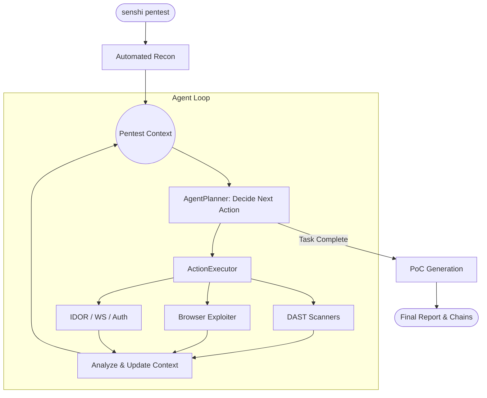

<p align="center">
  <h1 align="center">Senshi (戦士)</h1>
  <p align="center">
    <strong>AI-powered SAST + DAST security scanner for bug bounty hunters</strong>
  </p>
  <p align="center">
    <a href="https://pypi.org/project/senshi/"></a>
    <a href="https://github.com/manthanghasadiya/senshi/blob/main/LICENSE"></a>
    
    
  </p>
</p>

---

Senshi uses LLMs to generate context-aware payloads, analyze responses intelligently, eliminate false positives, and chain findings into exploitable attack paths — all from a single CLI.

**Created by [Manthan Ghasadiya](https://github.com/manthanghasadiya)** — creator of [mcpsec](https://github.com/manthanghasadiya/mcpsec) (4 CVEs including CVSS 10.0) and [igris](https://github.com/manthanghasadiya/igris).

## Why Senshi?

Traditional scanners fire generic payloads and drown you in false positives. Senshi is different:

- **🧠 AI-First** — LLMs generate payloads tailored to the target's tech stack and context
- **🚫 FP Elimination** — A skeptical 2nd-pass AI reviewer slashes false positives
- **🔗 Chain Builder** — Links individual findings into high-impact exploit chains
- **📋 Bounty Reports** — LLM writes your HackerOne/MSRC submission for you
- **🔌 Provider Agnostic** — DeepSeek, OpenAI, Groq, Ollama, Anthropic — your choice

## Features

| Feature | Description |
|---------|-------------|
| **Autonomous Pentesting** | Think \u2192 Act \u2192 Observe LLM agent loop with browser execution |
| **DAST** | Crawl, probe, inject, and analyze live endpoints |
| **SAST** | Deep source code analysis with multi-language support |
| **10+ DAST Scanners** | XSS, SSRF, IDOR, SQLi, CMDi, SSTI, Open Redirect, Auth bypass, Deserialization, Info Disclosure |
| **5 SAST Scanners** | Injection, Auth, Crypto, Config, AI pattern detection |
| **Auto-Recon** | Endpoint discovery, JS analysis, tech fingerprinting |
| **Browser Recon & Testing**| Headless Chromium captures traffic and confirms vulnerabilities via Playwright |
| **Smart Routing** | Scanners only run on relevant endpoints (~2x speedup) |
| **Batch Analysis** | 1 LLM call per endpoint per scanner (~6x fewer API calls) |
| **Progressive Save** | Results saved to disk as found \u2014 Ctrl+C preserves findings |
| **4 Output Formats** | JSON, Markdown, SARIF (CI/CD), Bounty Report |

## Installation

```bash
pip install senshi
```

Or from source:

```bash
git clone https://github.com/manthanghasadiya/senshi.git
cd senshi
pip install -e ".[dev,browser,websocket]"
```

## Quick Start

### 1. Set your API key

```bash
export DEEPSEEK_API_KEY="sk-..."
# or: export OPENAI_API_KEY="sk-..."
# or: export GROQ_API_KEY="gsk_..."
```

### 2. Scan

```bash
# Autonomous Black-Box Pentest (v0.3.0)
senshi pentest https://target.com --provider deepseek --browser --verbose

# DAST \u2014 scan live targets
senshi dast https://target.com --provider deepseek

# With auth + Burp proxy
senshi dast https://target.com/api \
  --auth "Cookie: session=abc" \
  --proxy http://127.0.0.1:8080

# Specific scanners only
senshi dast https://target.com --modules xss,ssrf,injection

# SAST — analyze source code
senshi sast ./my-project
senshi sast https://github.com/user/repo.git

# Recon only
senshi recon https://target.com --depth 3

# Browser-based recon (captures XHR/fetch traffic)
senshi recon https://target.com --browser --output endpoints.json

# DAST with pre-discovered endpoints
senshi dast https://target.com --endpoints endpoints.json

# Generate payloads
senshi payloads --vuln xss --target "POST /api/chat" --param message

# Generate bounty report from findings
senshi report findings.json --platform hackerone --output report.md
```

## CLI Reference

| Command | Description |
|---------|-------------|
| `senshi pentest <url>` | Run autonomous pentest agent |
| `senshi dast <url>` | Scan live web endpoints |
| `senshi sast <path>` | Analyze source code (dir, git URL, or zip) |
| `senshi recon <url>` | Discover endpoints (no scanning) |
| `senshi payloads` | Generate payloads for manual testing |
| `senshi report <file>` | Generate bounty report from findings JSON |
| `senshi config` | Configure API keys and settings |

## DAST Scanners

| Scanner | Vulnerability Types |
|---------|-------------------|
| `xss` | Reflected, stored, DOM, markdown injection |
| `ssrf` | Cloud metadata, internal services, DNS rebind |
| `idor` | ID enumeration, path-based access control |
| `injection` | SQLi (error + blind), command injection, SSTI |
| `auth` | Auth bypass, method switching, header bypass |
| `deserialization` | Prototype pollution, pickle, YAML, XXE |
| `ai_product` | Prompt injection, data leakage, cross-user |

## SAST Scanners

| Scanner | Focus |
|---------|-------|
| Injection | SQLi, command injection, SSRF, path traversal in code |
| Auth | Hardcoded creds, missing auth checks, broken access control |
| Crypto | Weak hashing (MD5/SHA1), hardcoded keys, insecure random |
| Config | Debug mode, CORS misconfiguration, missing security headers |
| AI | Prompt injection sinks, unsafe eval of LLM output |

## Output Formats

- **JSON** — Machine-readable, re-importable with `senshi report`
- **Markdown** — Human-readable with severity indicators and evidence blocks
- **SARIF** — CI/CD integration (GitHub Code Scanning, Azure DevOps)
- **Bounty Report** — LLM-written submission tailored to your platform

## Supported LLM Providers

| Provider | Environment Variable | Default Model |
|----------|---------------------|---------------|
| DeepSeek | `DEEPSEEK_API_KEY` | `deepseek-chat` |
| OpenAI | `OPENAI_API_KEY` | `gpt-4o-mini` |
| Groq | `GROQ_API_KEY` | `llama-3.3-70b-versatile` |
| Ollama | — (local) | `llama3.1` |
| Anthropic | `ANTHROPIC_API_KEY` | `claude-3.5-sonnet` |

## Architecture

## Architecture

Senshi operates on an autonomous **Think \u2192 Act \u2192 Observe** loop, building context across iterations:



## Development

```bash
git clone https://github.com/manthanghasadiya/senshi.git
cd senshi
pip install -e ".[dev]"

# For browser recon support
pip install -e ".[browser]"
playwright install chromium

pytest tests/ -v
```

See [CONTRIBUTING.md](CONTRIBUTING.md) for details.

## Legal

> [!CAUTION]
> Senshi is intended for **authorized security testing only**. Only scan targets you have explicit written permission to test. Unauthorized scanning is illegal. See [SECURITY.md](SECURITY.md).

## License

MIT License — see [LICENSE](LICENSE) for details.
